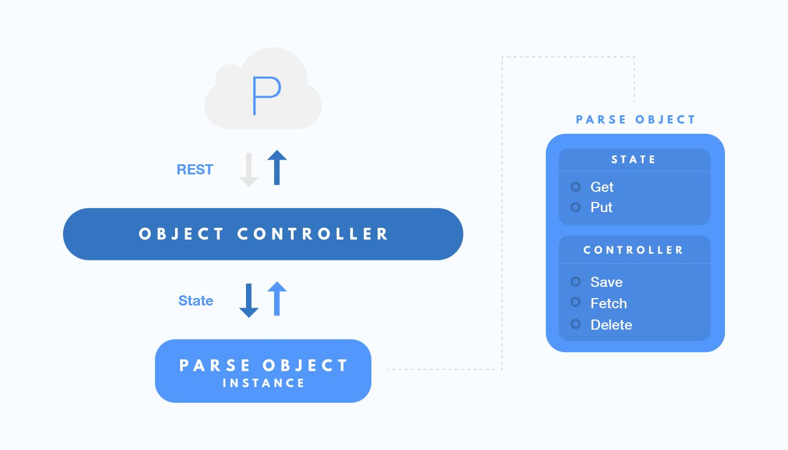

build-lists: true

<br>
<br>
# Inside Parse SDK
<br>
#### Nikita Lutsenko
#### @nlutsenko
#### Facebook, Parse

---

# Hi

- Nikita Lutsenko
- @nlutsenko
- Facebook
- Slingshot
- Parse

---

## Inside Parse SDK

- ~730 Source Files
- ~51000 Lines of Code
- ~150 Classes+Protocols
- 767 Unit Tests
- Support for iOS, OS X, watchOS, tvOS
- 2 Maintainers

---

# That's all folks.
# Thank you.
# 🙌

---

# Not that simple...
## 😁

---

# Parse SDK

- Object & File Storage
- Query Engine
- Local Datastore
- User Authentication
- Global Configuration
- Analytics & Push Notifications
- Much more...

---


## Parse SDKs now power
## **800 million** active
## [fit]app-device pairs **per month**

---

# Inside Parse SDK

- Promises for Asynchronous Operations
- Instance/Controller/State Architecture
- Lazy-loaded Dependency Injection
- Written in ObjC, works in Swift
- ???
- PROFIT!!!

---

# Promise everything!

- Perform asynchronous work
  - Serially or in Parallel
- Errors, cancellation, chaining
- Unified across ObjC/Java/.NET
- Light-weight and Extendable

---

# 🔩 Bolts.framework

- Composable Promise Framework
  - Tasks, Executors, Cancellation Tokens
- Avaialble for ObjC, Java, .NET
- Open Source
  - github.com/BoltsFramework
- Coming to Swift!

---

```objc
- (NSData *)dataWithContentsOfFile:(NSString *)file {
    NSError *error = nil;
    NSData *data = [NSData dataWithContentsOfFile:file
                                          options:NSDataReadingMappedIfSafe
                                            error:&error];
    return data;
}
```

---

```objc
- (NSData *)dataWithContentsOfFile:(NSString *)file
                             error:(NSError **)error {
    NSData *data = [NSData dataWithContentsOfFile:file
                                          options:NSDataReadingMappedIfSafe
                                            error:&error];
    return data;
}
```

---

```objc
- (void)getDataWithContentsOfFile:(NSString *)file
                       completion:(void (^)(NSData *data))completion {
    dispatch_async(dispatch_get_global_queue(DISPATCH_QUEUE_PRIORITY_DEFAULT, 0), ^{
        NSError *error = nil;
        NSData *data = [NSData dataWithContentsOfFile:file
                                              options:NSDataReadingMappedIfSafe
                                                error:&error];
        completion(data);
    });
}
```

---

```objc
- (void)getDataWithContentsOfFile:(NSString *)file
                       completion:(void (^)(NSData *data, NSError *error))completion {
    dispatch_async(dispatch_get_global_queue(DISPATCH_QUEUE_PRIORITY_DEFAULT, 0), ^{
        NSError *error = nil;
        NSData *data = [NSData dataWithContentsOfFile:file
                                              options:NSDataReadingMappedIfSafe
                                                error:&error];
        completion(data, error);
    });
}
```

---

```objc
- (void)getDataWithContentsOfFile:(NSString *)file
                       completion:(void (^)(NSData *data, NSError *error))completion { ... }

- (void)doWorkForFile:(NSString *)file {
    [self getDataWithContentsOfFile:file completion:^(NSData *data, NSError *error) {
        if (error) {
            [self reportError:error];
        } else {
            [self continueWorkForData:data];
        }
        [self deleteFile:file];
    }];
}
```

---

```objc
- (void)getDataWithContentsOfFile:(NSString *)file
                       completion:(void (^)(NSData *data, NSError *error))completion { ... }

- (void)doWorkForFile:(NSString *)file {
    [self getDataWithContentsOfFile:file completion:^(NSData *data, NSError *error) {
        if (error) {
            [self reportError:error];
            [self deleteFile:file];
        } else {
            [self continueWorkForData:data completion:^(NSError *error) {
                if (error) {
                    [self reportError:error];
                }
                [self deleteFile:file];
            }];
        }
    }];
}
```

---

```objc
- (void)getDataWithContentsOfFile:(NSString *)file
                       completion:(void (^)(NSData *data, NSError *error))completion { ... }

- (void)doWorkForFile:(NSString *)file {
    [self getDataWithContentsOfFile:file completion:^(NSData *data, NSError *error) {
        if (error) {
            [self reportError:error]; // << Duplicate error handling 😰
            [self deleteFile:file];
        } else {
            [self continueWorkForData:data completion:^(NSError *error) {
                if (error) {
                    [self reportError:error]; // << Duplicate error handling 😰
                }
                [self deleteFile:file];
            }];
        }
    }];
}
```

---

```objc
- (void)getDataWithContentsOfFile:(NSString *)file
                       completion:(void (^)(NSData *data, NSError *error))completion { ... }

- (void)doWorkForFile:(NSString *)file {
    [self getDataWithContentsOfFile:file completion:^(NSData *data, NSError *error) {
        if (error) {
            [self reportError:error]; // << Duplicate error handling 😰
            [self deleteFile:file]; // << Duplicate code 😰
        } else {
            [self continueWorkForData:data completion:^(NSError *error) {
                if (error) {
                    [self reportError:error]; // << Duplicate error handling 😰
                }
                [self deleteFile:file]; // << Duplicate code 😰
            }];
        }
    }];
}
```

---

```objc
- (void)getDataWithContentsOfFile:(NSString *)file
                       completion:(void (^)(NSData *data, NSError *error))completion {
    dispatch_async(dispatch_get_global_queue(DISPATCH_QUEUE_PRIORITY_DEFAULT, 0), ^{
        NSError *error = nil;
        NSData *data = [NSData dataWithContentsOfFile:file
                                              options:NSDataReadingMappedIfSafe
                                                error:&error];
        completion(data, error);
    });
}
```

---

```objc
- (BFTask <NSData *>*)getDataAsyncWithContentsOfFile:(NSString *)file { // << Return a BFTask 🔩
    return [BFTask taskFromExecutor:[BFExecutor defaultPriorityBackgroundExecutor] withBlock:^id{
        NSError *error = nil;
        NSData *data = [NSData dataWithContentsOfFile:file
                                              options:NSDataReadingMappedIfSafe
                                                error:&error];
        if (error) {
            return [BFTask taskWithError:error];
        }
        return data;
    }];
}
```

---

```objc
- (BFTask <NSData *>*)getDataAsyncWithContentsOfFile:(NSString *)file { ... }

- (void)doWorkForFile:(NSString *)file {
    [[[self getDataAsyncWithContentsOfFile:file] continueWithBlock:^id(BFTask<NSData *> *task) {
        if (error) {
            [self reportError:error]; // << Duplicate error handling 😰
            [self deleteFile:file]; // << Duplicate code 😰
        } else {
            [self continueWorkForData:data completion:^(NSError *error) {
                if (error) {
                    [self reportError:error]; // << Duplicate error handling 😰
                }
                [self deleteFile:file]; // << Duplicate code 😰
            }];
        }
    }];
}
```

---

```objc
- (BFTask <NSData *>*)getDataAsyncWithContentsOfFile:(NSString *)file { ... }

- (void)doWorkForFile:(NSString *)file {
    [[[self getDataAsyncWithContentsOfFile:file] continueWithSuccessBlock:^id(BFTask<NSData *> *task) {
        return [self continueWorkAsyncForData:data];     // << Return a BFTask 🙌
    }] continueWithBlock:^id(BFTask<NSData *> *task) {
        if (task.faulted) {
            [self reportError:error];
        }
        [self deleteFile:file];
        return nil;
    }];
}
```

---

```objc
- (BFTask <NSData *>*)getDataAsyncWithContentsOfFile:(NSString *)file { ... }

- (void)doWorkForFile:(NSString *)file {
    [[[self getDataAsyncWithContentsOfFile:file] continueWithSuccessBlock:^id(BFTask<NSData *> *task) {
        return [self continueWorkAsyncForData:data];
    }] continueWithBlock:^id(BFTask<NSData *> *task) {
        if (task.faulted) {
            [self reportError:error];
        }
        return [self deleteFileAsync:file]; // << Return a BFTask 🙌
    }];
}
```

---

```objc
- (BFTask <NSData *>*)getDataAsyncWithContentsOfFile:(NSString *)file { ... }

- (BFTask *)doWorkAsyncForFile:(NSString *)file { // << Return a BFTask 🙌
    return [[[self getDataAsyncWithContentsOfFile:file] continueWithSuccessBlock:^id(BFTask<NSData *> *task) {
        return [self continueWorkAsyncForData:data];
    }] continueWithBlock:^id(BFTask<NSData *> *task) {
        if (task.faulted) {
            [self reportError:error];
        }
        return [self deleteFile:file];
    }];
}
```

---

## That's all good...

---

## But how do you manage complexity? 🐥?

---

# [fit] Instance vs Controller vs State 👯

- Separation of Concerns and Responsbilities
- Lazy Dependency Injection
- No Mutable State
- Thread-safe
- Awesome!

---

## Instance vs Controller vs State

- Instance 😁
  - Public API
  - Immutable State
- State 🤕
  - Current Object State
- Controller 💪
  - Acts on State
  - Returns State

---



---

```objc

@interface PFFile : NSObject

@property NSString *urlString;
@property NSString *name;

- (BFTask<NSData *> *)getDataInBackground;
- (BFTask *)saveInBackground;

@end
```

---

```objc
@interface PFFileState : PFBaseState <PFBaseStateSubclass, NSCopying, NSMutableCopying>

@property (nonatomic, copy, readonly) NSString *name;
@property (nullable, nonatomic, copy, readonly) NSString *urlString;
@property (nullable, nonatomic, copy, readonly) NSString *mimeType;

@end

@interface PFMutableFileState : PFFileState

@property (nonatomic, copy, readwrite) NSString *name;
@property (nullable, nonatomic, copy, readwrite) NSString *urlString;
@property (nullable, nonatomic, copy, readwrite) NSString *mimeType;

@end
```

---

# Base State

- Base class for every state.
- `NSCopying`, `NSMutableCopying`.
- Equality and Comparison
  - `-isEqual:`
  - `-compare:`
  - `-hash`

---

```objc
@interface PFFileState : PFBaseState <PFBaseStateSubclass, NSCopying, NSMutableCopying>

@property (nonatomic, copy, readonly) NSString *name;
@property (nullable, nonatomic, copy, readonly) NSString *urlString;
@property (nullable, nonatomic, copy, readonly) NSString *mimeType;

@end

@interface PFMutableFileState : PFFileState

@property (nonatomic, copy, readwrite) NSString *name;
@property (nullable, nonatomic, copy, readwrite) NSString *urlString;
@property (nullable, nonatomic, copy, readwrite) NSString *mimeType;

@end
```

---

```objc
@interface PFFileState : PFBaseState <PFBaseStateSubclass, NSCopying, NSMutableCopying>

@property (nonatomic, copy, readonly) NSString *name;
@property (nullable, nonatomic, copy, readonly) NSString *urlString;
@property (nullable, nonatomic, copy, readonly) NSString *mimeType;

- (instancetype)initWithState:(PFFileState *)state;
+ (instancetype)stateWithState:(PFFileState *)state;

- (BOOL)isEqual:(id)object;
- (NSInteger)hash;
- (NSComparisonResult)compare:(PFFileState *)object;

- (NSDictionary *)dictionaryRepresentation;
- (id)debugQuickLookObject;

@end
```

---

```objc
@implementation PFFileState

+ (NSDictionary *)propertyAttributes {
    return @{
        @"name" : [PFPropertyAttributes attributesWithAssociationType:PFPropertyInfoAssociationTypeCopy],
        @"urlString" : [PFPropertyAttributes attributesWithAssociationType:PFPropertyInfoAssociationTypeCopy],
        @"mimeType" : [PFPropertyAttributes attributesWithAssociationType:PFPropertyInfoAssociationTypeCopy],
    };
}

- (id)copyWithZone:(NSZone *)zone {
    return [[PFFileState allocWithZone:zone] initWithState:self];
}

- (instancetype)mutableCopyWithZone:(NSZone *)zone {
    return [[PFMutableFileState allocWithZone:zone] initWithState:self];
}

@end
```

---

```objc
@implementation PFMutableFileState

@dynamic name;
@dynamic urlString;
@dynamic mimeType;

@end
```

---

## Wait...

---

## How about controllers?

---

```objc
@interface PFFileController : NSObject

@property (nonatomic, weak, readonly) id<PFCommandRunnerProvider, PFFileManagerProvider> dataSource;

+ (instancetype)controllerWithDataSource:(id<PFCommandRunnerProvider, PFFileManagerProvider>)dataSource;

- (BFTask<PFFileState *> *)downloadFileAsyncWithState:(PFFileState *)fileState...
- (BFTask<PFFileState *> *)uploadFileAsyncWithState:(PFFileState *)fileState...

@end
```

---

```objc
@protocol PFCommandRunnerProvider <NSObject>

@property (nonatomic, strong, readonly) id<PFCommandRunning> commandRunner;

@end

@protocol PFFileManagerProvider <NSObject>

@property (nonatomic, strong, readonly) PFFileManager *fileManager;

@end
```

---

```objc
@protocol PFNoYoloControllerProvider <NSObject>

@property (nonatomic, strong, readonly) PFNoYoloController *noYoloController;

@end

@protocol PFYoloControllerProvider <NSObject>

@property (null_resettable, nonatomic, strong) PFYoloController *yoloController;

@end
```

---

```objc
- (PFYoloController *)yoloController {
    __block PFYoloController *controller = nil;
    dispatch_sync(_controllerAccessQueue, ^{
        if (!_yoloController) {
            _yoloController = [PFYoloController controllerWithDataSource:self.dataSource];
        }
        controller = _yoloController;
    });
    return controller;
}

- (void)setYoloController:(PFYoloController *)controller {
    dispatch_sync(_controllerAccessQueue, ^{
        _yoloController = controller;
    });
}
```

---

## Thank you!

---

<br>
<br>
# Questions?
<br>
#### @nlutsenko
#### github.com/BoltsFramework
#### github.com/ParsePlatform